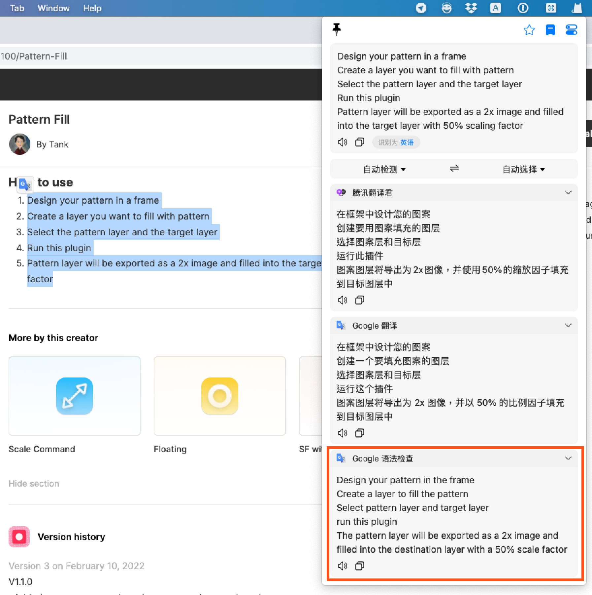

# bobplugin-google-translate-grammar-checker

> 这是 [Bob](https://ripperhe.gitee.io/bob/#/) 的一个 google 语法检查插件, 基于 [Bob google 翻译插件](https://github.com/roojay520/bobplugin-google-translate)修改而来。插件会先将输入的文本使用 google 翻译一遍，再把翻译结果用 google 翻译回输入语言，适用于书写英文时查看 Google 翻译推荐的写法，也许可以帮你纠正时态、补充定语、推荐更准确的单词等。

## 特性

- 同语言书写结果推荐
- 其它特性请查看[Bob google 翻译插件](https://github.com/roojay520/bobplugin-google-translate)

## 安装

1. 安装 [Bob](https://ripperhe.gitee.io/bob/#/general/quickstart/install) (version >= 0.50)
2. 下载插件: [bobplugin-google-translate-grammar-checker](https://github.com/tankxu/bobplugin-google-translate-grammar-checker/releases)
3. 插件安装: [Bob 插件安装文档说明](https://ripperhe.gitee.io/bob/#/general/quickstart/plugin?id=%e5%ae%89%e8%a3%85%e6%8f%92%e4%bb%b6)

## 预览

